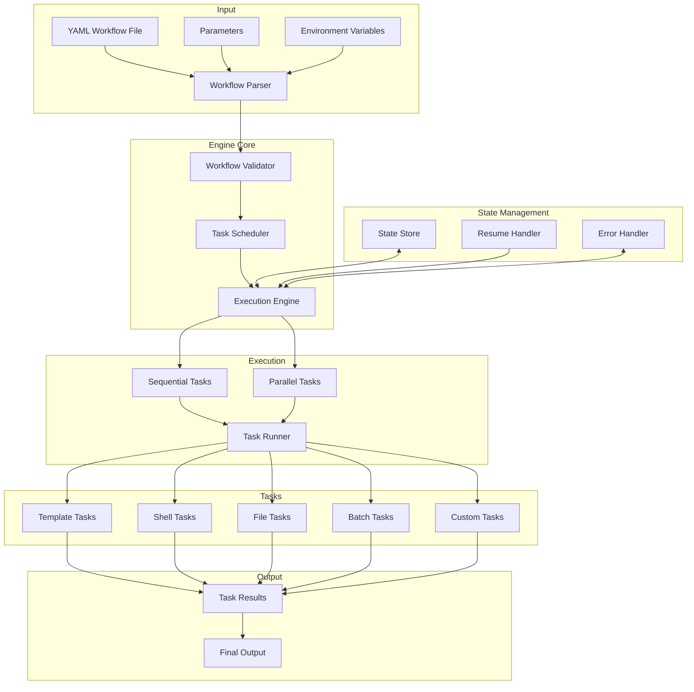
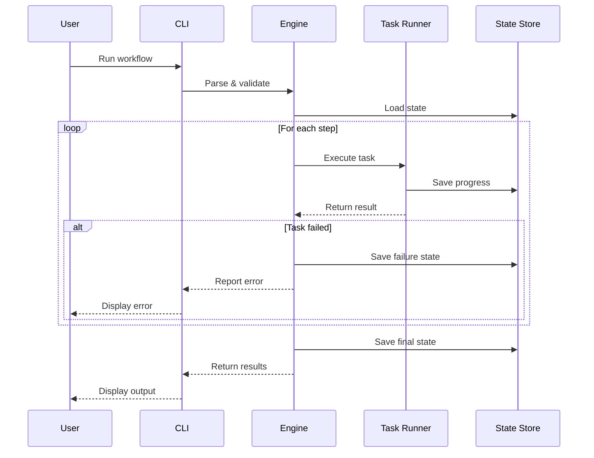

# YAML Workflow Engine

A powerful and flexible workflow engine that executes tasks defined in YAML configuration files. This engine allows you to create modular, reusable workflows by connecting tasks through YAML definitions, with support for parallel processing, batch operations, and state management.

## Architecture





## Features

- 📝 YAML-driven workflow definition
- 🔌 Dynamic module and function loading
- 🔄 Input/output variable management
- ⚠️ Comprehensive error handling
- 🔁 Retry mechanisms
- ⚡ Parallel processing support
- 🚦 API rate limiting
- 📊 Progress tracking and logging
- 💾 State persistence and resume capability
- 🔄 Batch processing with chunking
- 🌐 Template variable substitution

## Quick Start

1. Set up your environment:
```bash
# Create and activate virtual environment
python -m venv .venv
source .venv/bin/activate  # On Unix/macOS
# On Windows use: .venv\Scripts\activate

# Install the package
pip install -e .

# Create output directory
mkdir -p output
```

2. Create a simple workflow (e.g., `workflows/hello_world.yaml`):
```yaml
name: Hello World
description: A simple workflow that creates a greeting

steps:
  - name: create_greeting
    task: template
    template: |
      Hello, {{ name }}!
      
      This is run #{{ run_number }} of the {{ workflow_name }} workflow.
      Created at: {{ timestamp }}
    output: greeting.txt
```

3. Run your workflow:
```bash
# Run with input parameters
yaml-workflow run workflows/hello_world.yaml name=Alice

# List available workflows
yaml-workflow list

# Validate a workflow
yaml-workflow validate workflows/hello_world.yaml

# Resume a failed workflow
yaml-workflow run workflows/hello_world.yaml --resume
```

## CLI Usage

```bash
# Run a workflow
yaml-workflow run workflows/hello_world.yaml name=Alice

# Run with specific options
yaml-workflow run workflows/hello_world.yaml --resume  # Resume from last failure
yaml-workflow run workflows/hello_world.yaml --start-from step2  # Start from specific step
yaml-workflow run workflows/hello_world.yaml --skip-steps step1,step3  # Skip specific steps

# List available workflows
yaml-workflow list
yaml-workflow list --base-dir custom/workflows  # Custom workflows directory

# Validate a workflow
yaml-workflow validate workflows/hello_world.yaml

# Workspace management
yaml-workflow workspace list  # List all workspaces
yaml-workflow workspace clean  # Clean old workspaces
yaml-workflow workspace remove workspace_name  # Remove specific workspace
```

## Workflow Structure

### Basic Structure
```yaml
name: My Workflow
description: Workflow description
version: "0.1.0"  # Optional

# Optional global settings
settings:
  timeout: 3600
  retry_count: 3
  max_workers: 4

# Optional environment variables
env:
  API_KEY: ${env:API_KEY}
  DEBUG: "true"

# Optional parameter definitions
params:
  input_file:
    description: Input file path
    type: string
    required: true
  batch_size:
    description: Number of items to process at once
    type: integer
    default: 10

# Workflow steps
steps:
  - name: step_name
    task: task_type
    params:
      param1: value1
    outputs:
      - output_var
```

### Available Task Types

1. **Template Tasks**
```yaml
- name: create_text
  task: template
  params:
    template: |
      Hello, {{ name }}!
      Created at: {{ timestamp }}
    output_file: output.txt
```

2. **Shell Tasks**
```yaml
- name: run_command
  task: shell
  params:
    command: |
      echo "Processing ${input_file}"
      cat ${input_file} | grep "pattern"
```

3. **File Tasks**
```yaml
- name: read_data
  task: file_utils
  params:
    file_path: data.txt
    encoding: utf-8
    format: json  # Optional: json, yaml, or text (default)
```

4. **Batch Processing Tasks**
```yaml
- name: process_files
  task: batch_processor
  params:
    parallel: true
    max_workers: 4
    chunk_size: 10
    items: ${file_list}
    processing_task:
      task: file_processor
      params:
        output_dir: ${output_directory}
```

### Task Features

1. **Parallel Processing**
- Use `parallel: true` to enable parallel execution
- Configure with `parallel_settings`:
  ```yaml
  parallel_settings:
    max_workers: 4  # Number of parallel workers
    timeout: 3600   # Timeout in seconds
    chunk_size: 10  # Items per chunk
  ```

2. **State Management**
- Enable state tracking with `resume_state: true`
- Use `--resume` flag to continue from failures
- State is saved per step and per chunk

3. **Conditional Execution**
```yaml
- name: conditional_step
  task: processor
  condition: ${previous_result.count > 0}
  inputs:
    data: ${previous_result.data}
```

4. **Error Handling**
```yaml
- name: api_call
  task: api_client
  error_handling:
    type: retry  # Available: skip, fail, retry, notify
    retry_count: 3
    retry_delay: 60
```

5. **Variable Substitution**
- Environment variables: `${env:VAR_NAME}`
- Step outputs: `${step_name.output_var}`
- Workflow parameters: `${param_name}`
- Special variables:
  - `${workspace}`: Current workspace directory
  - `${run_number}`: Current run number
  - `${timestamp}`: Current timestamp
  - `${workflow_name}`: Name of the workflow

6. **Template Processing**
- Use Jinja2 syntax in templates: `{{ variable }}`
- Supports filters: `{{ name|upper }}`
- Conditional rendering: `...`

### Best Practices

1. **Workflow Organization**
- Use descriptive step names
- Group related steps together
- Add comments to explain complex steps
- Use consistent naming conventions

2. **Error Handling**
- Add appropriate retry mechanisms
- Define fallback behaviors
- Log important information
- Use conditional steps for error handling

3. **Resource Management**
- Configure appropriate timeouts
- Set reasonable parallel worker counts
- Use chunking for large datasets
- Monitor memory usage

4. **State Management**
- Enable resume capability for long-running workflows
- Save important state information
- Use appropriate chunk sizes
- Handle cleanup in failure cases

## Development

1. Install development dependencies:
```bash
pip install -e ".[dev]"
```

2. Run tests:
```bash
pytest
```

3. Format code:
```bash
black src/
```

4. Type checking:
```bash
mypy src/
```

## Creating Custom Tasks

1. Create a new task module in `src/yaml_workflow_engine/tasks/`:
```python
"""
Custom task module.
"""
from typing import Any, Dict
from pathlib import Path
from . import register_task

@register_task("my_task_type")
def my_custom_task(
    step: Dict[str, Any],
    context: Dict[str, Any],
    workspace: Path
) -> Any:
    """
    Custom task implementation.
    
    Args:
        step: Step configuration
        context: Workflow context
        workspace: Workspace directory
    
    Returns:
        Any: Task result
    """
    # Implementation here
    return result
```

2. Use it in your workflow:
```yaml
steps:
  - name: custom_step
    task: my_task_type
    function: my_function
    inputs:
      param1: value1
    outputs:
      - result
```

## Contributing

1. Fork the repository
2. Create a feature branch
3. Make your changes
4. Run tests and type checking
5. Submit a pull request

## License

MIT License - see LICENSE file for details