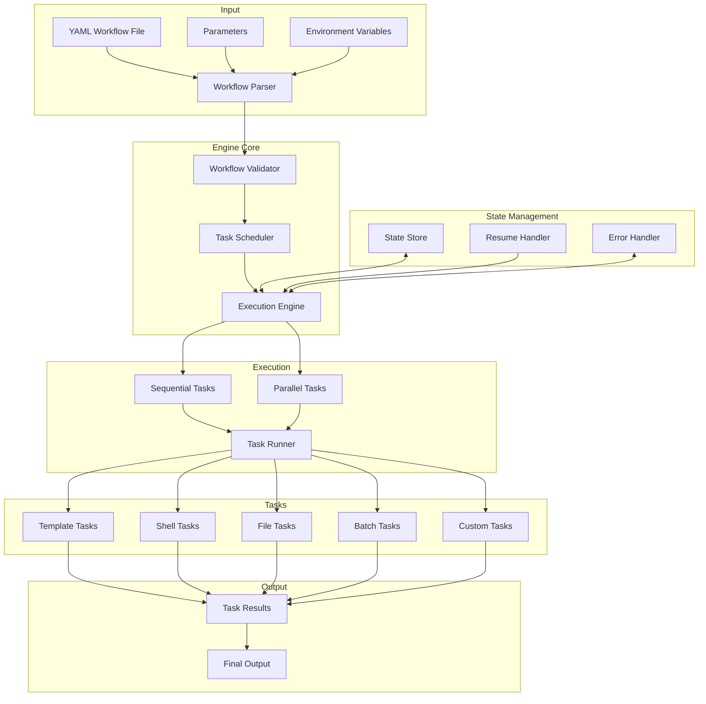
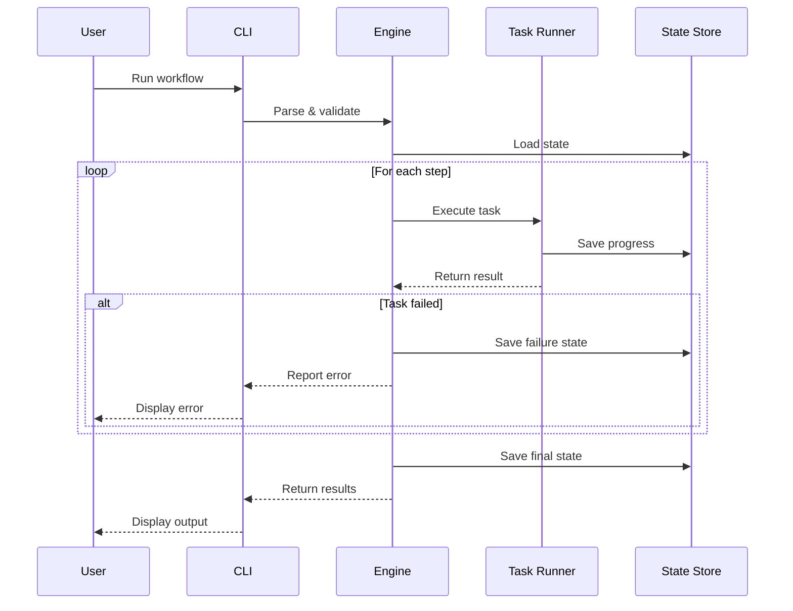

# YAML Workflow Engine

A powerful and flexible workflow engine that executes tasks defined in YAML configuration files. This engine allows you to create modular, reusable workflows by connecting tasks through YAML definitions, with support for parallel processing, batch operations, and state management.

## Architecture





## Features

- 📝 YAML-driven workflow definition
- 🔌 Dynamic module and function loading
- 🔄 Input/output variable management
- ⚠️ Comprehensive error handling
- 🔁 Retry mechanisms
- ⚡ Parallel processing support
- 🚦 API rate limiting
- 📊 Progress tracking and logging
- 💾 State persistence and resume capability
- 🔄 Batch processing with chunking
- 🌐 Template variable substitution
- 🔀 Flow control with custom step sequences

## Quick Start

1. Set up your environment:
```bash
# Create and activate virtual environment
python -m venv .venv
source .venv/bin/activate  # On Unix/macOS
# On Windows use: .venv\Scripts\activate

# Install the package
pip install -e .

# Initialize project with example workflows
yaml-workflow init
# Or specify custom directory:
# yaml-workflow init --dir my-workflows
```

2. Create a simple workflow (e.g., `workflows/hello_world.yaml`):
```yaml
name: Hello World
description: A simple workflow that creates a greeting

steps:
  - name: create_greeting
    task: template
    template: |
      Hello, {{ name }}!
      
      This is run #{{ run_number }} of the {{ workflow_name }} workflow.
      Created at: {{ timestamp }}
    output: greeting.txt
```

3. Run your workflow:
```bash
# Run with input parameters
yaml-workflow run workflows/hello_world.yaml name=Alice

# List available workflows
yaml-workflow list

# Validate a workflow
yaml-workflow validate workflows/hello_world.yaml

# Resume a failed workflow
yaml-workflow run workflows/hello_world.yaml --resume
```

## CLI Usage

```bash
# Initialize project with example workflows
yaml-workflow init  # Creates workflows in 'workflows' directory
yaml-workflow init --dir custom/workflows  # Custom directory
yaml-workflow init --example hello_world  # Copy specific example only

# Run a workflow
yaml-workflow run workflows/hello_world.yaml name=Alice

# Run with specific options
yaml-workflow run workflows/hello_world.yaml --resume  # Resume from last failure
yaml-workflow run workflows/hello_world.yaml --start-from step2  # Start from specific step
yaml-workflow run workflows/hello_world.yaml --skip-steps step1,step3  # Skip specific steps
yaml-workflow run workflows/hello_world.yaml --flow data_collection  # Run specific flow

# List available workflows
yaml-workflow list
yaml-workflow list --base-dir custom/workflows  # Custom workflows directory

# Validate a workflow
yaml-workflow validate workflows/hello_world.yaml

# Workspace management
yaml-workflow workspace list  # List all workspaces
yaml-workflow workspace clean  # Clean old workspaces
yaml-workflow workspace remove workspace_name  # Remove specific workspace
```

## Workflow Structure

### Basic Structure
```yaml
name: My Workflow
description: Workflow description
version: "0.1.0"  # Optional

# Optional global settings
settings:
  timeout: 3600
  retry_count: 3
  max_workers: 4

# Optional environment variables
env:
  API_KEY: ${env:API_KEY}
  DEBUG: "true"

# Optional parameter definitions
params:
  input_file:
    description: Input file path
    type: string
    required: true
  batch_size:
    description: Number of items to process at once
    type: integer
    default: 10

# Optional flow definitions
flows:
  default: process  # Optional, defaults to "all" if not specified
  definitions:
    - process: [step1, step3, step4]  # Main processing flow
    - data_collection: [step2, step5]  # Data collection flow
    - validation: [step1, step2]  # Validation flow

# Workflow steps
steps:
  - name: step1
    task: task_type
    params:
      # ... step parameters ...

  - name: step2
    task: task_type
    params:
      # ... step parameters ...
```

### Flow Control

The workflow engine supports defining multiple flows within a single workflow. Each flow represents a specific sequence of steps to execute. This allows you to:

- Define different execution paths for different purposes
- Reuse steps across different flows
- Switch between flows via command line
- Resume failed flows from the last failed step

#### Flow Configuration

```yaml
flows:
  # Optional default flow to use when no flow is specified
  default: process
  
  # Flow definitions
  definitions:
    # Each item defines a named flow with its step sequence
    - process: [step1, step3, step4]
    - data_collection: [step2, step5]
    - validation: [step1, step2]
```

#### Special Flows

- `all`: A predefined flow that executes all steps in sequence (default if no flows defined)
- Default flow: Specified by `flows.default`, used when no flow is provided via CLI

#### Using Flows

1. Command Line:
```bash
# Run specific flow
yaml-workflow run workflow.yaml --flow data_collection

# Run default flow
yaml-workflow run workflow.yaml

# Run all steps in sequence
yaml-workflow run workflow.yaml --flow all
```

2. Resuming Flows:
```bash
# Resume failed workflow (continues with same flow)
yaml-workflow run workflow.yaml --resume
```

#### Flow Validation

The engine validates:
- All referenced steps exist in the workflow
- No duplicate flow names
- Default flow exists in definitions (if specified)
- Flow exists when specified via CLI
- Same flow is used when resuming a workflow

#### Best Practices

1. Define a default flow for common execution paths
2. Use descriptive flow names that indicate their purpose
3. Keep flows focused and minimal
4. Use the "all" flow for full workflow execution
5. Consider step dependencies when defining flows

### Available Task Types

1. **Template Tasks**
```yaml
- name: create_text
  task: template
  params:
    template: |
      Hello, {{ name }}!
      Created at: {{ timestamp }}
    output_file: output.txt
```

2. **Shell Tasks**
```yaml
- name: run_command
  task: shell
  params:
    command: |
      echo "Processing ${input_file}"
      cat ${input_file} | grep "pattern"
```

3. **File Tasks**
```yaml
- name: read_data
  task: file_utils
  params:
    file_path: data.txt
    encoding: utf-8
    format: json  # Optional: json, yaml, or text (default)
```

4. **Batch Processing Tasks**
```yaml
- name: process_files
  task: batch_processor
  params:
    parallel: true
    max_workers: 4
    chunk_size: 10
    items: ${file_list}
    processing_task:
      task: file_processor
      params:
        output_dir: ${output_directory}
```

### Task Features

1. **Parallel Processing**
- Use `parallel: true` to enable parallel execution
- Configure with `parallel_settings`:
  ```yaml
  parallel_settings:
    max_workers: 4  # Number of parallel workers
    timeout: 3600   # Timeout in seconds
    chunk_size: 10  # Items per chunk
  ```

2. **State Management**
- Enable state tracking with `resume_state: true`
- Use `--resume` flag to continue from failures
- State is saved per step and per chunk

3. **Conditional Execution**
```yaml
- name: conditional_step
  task: processor
  condition: ${previous_result.count > 0}
  inputs:
    data: ${previous_result.data}
```

4. **Error Handling**
```yaml
- name: api_call
  task: api_client
  error_handling:
    type: retry  # Available: skip, fail, retry, notify
    retry_count: 3
    retry_delay: 60
```

5. **Variable Substitution**
- Environment variables: `${env:VAR_NAME}`
- Step outputs: `${step_name.output_var}`
- Workflow parameters: `${param_name}`
- Special variables:
  - `${workspace}`: Current workspace directory
  - `${run_number}`: Current run number
  - `${timestamp}`: Current timestamp
  - `${workflow_name}`: Name of the workflow

6. **Template Processing**
- Use Jinja2 syntax in templates: `{{ variable }}`
- Supports filters: `{{ name|upper }}`
- Conditional rendering: `...`

### Best Practices

1. **Workflow Organization**
- Use descriptive step names
- Group related steps together
- Add comments to explain complex steps
- Use consistent naming conventions

2. **Error Handling**
- Add appropriate retry mechanisms
- Define fallback behaviors
- Log important information
- Use conditional steps for error handling

3. **Resource Management**
- Configure appropriate timeouts
- Set reasonable parallel worker counts
- Use chunking for large datasets
- Monitor memory usage

4. **State Management**
- Enable resume capability for long-running workflows
- Save important state information
- Use appropriate chunk sizes
- Handle cleanup in failure cases

## Development

1. Install development dependencies:
```bash
pip install -e ".[dev]"
```

2. Run tests:
```bash
pytest
```

3. Format code:
```bash
black src/
```

4. Type checking:
```bash
mypy src/
```

## Creating Custom Tasks

1. Create a new task module in `src/yaml_workflow_engine/tasks/`:
```python
"""
Custom task module.
"""
from typing import Any, Dict
from pathlib import Path
from . import register_task

@register_task("my_task_type")
def my_custom_task(
    step: Dict[str, Any],
    context: Dict[str, Any],
    workspace: Path
) -> Any:
    """
    Custom task implementation.
    
    Args:
        step: Step configuration
        context: Workflow context
        workspace: Workspace directory
    
    Returns:
        Any: Task result
    """
    # Implementation here
    return result
```

2. Use it in your workflow:
```yaml
steps:
  - name: custom_step
    task: my_task_type
    function: my_function
    inputs:
      param1: value1
    outputs:
      - result
```

## Contributing

1. Fork the repository
2. Create a feature branch
3. Make your changes
4. Run tests and type checking
5. Submit a pull request

## License

MIT License - see LICENSE file for details

## Task Definition Methods

The workflow engine supports two complementary methods for defining tasks in your workflow:

### 1. Task Registry
```yaml
- name: create_greeting
  task: template  # Registered task name
  params:  # Parameters passed to the task
    template: |
      Hello, {{ name }}!
      Created at: {{ timestamp }}
    output_file: greeting.txt
  outputs:
    - greeting_path
```

This method uses registered task names and is ideal when:
- ✅ Using built-in tasks
- ✅ Working with common, standardized operations
- ✅ Wanting simpler configuration
- ✅ Needing quick access to core functionality

### 2. Module/Function
```yaml
- name: create_greeting
  module: my_company.workflow_tasks.template  # Custom module path
  function: render_template  # Function name in module
  inputs:  # Parameters passed to the function
    template: |
      Hello, {{ name }}!
      Created at: {{ timestamp }}
    output_file: greeting.txt
  outputs:
    - greeting_path
```

This method uses Python module paths and is powerful when:
- ✅ Implementing custom task logic
- ✅ Avoiding task name conflicts
- ✅ Maintaining organization-specific task libraries
- ✅ Needing full control over task implementation
- ✅ Working with multiple versions of similar tasks

### Task Implementation Strategies

1. **Using Built-in Tasks**
```yaml
# Using registered task
- name: run_shell
  task: shell
  params:
    command: "echo 'Hello'"
```

2. **Custom Implementation of Standard Task**
```yaml
# Using custom shell implementation
- name: run_shell
  module: my_company.tasks.shell
  function: run_command
  inputs:
    command: "echo 'Hello'"
```

3. **Namespace Management**
```yaml
# Default shell task
- name: basic_shell
  task: shell
  params:
    command: "echo 'Basic'"

# Custom shell task with additional features
- name: advanced_shell
  module: my_company.enhanced_tasks.shell
  function: run_secure_command
  inputs:
    command: "echo 'Advanced'"
    security_level: high
```

4. **Version-Specific Implementation**
```yaml
# Version 1 implementation
- name: process_data_v1
  module: my_company.tasks.v1.processor
  function: process
  inputs:
    data: ${input_data}

# Version 2 implementation
- name: process_data_v2
  module: my_company.tasks.v2.processor
  function: process
  inputs:
    data: ${input_data}
    new_feature: true
```

### Task Implementation Examples

1. **Template Processing**
```yaml
# Built-in template task
- name: simple_template
  task: template
  params:
    template: "Basic template"
    output_file: output.txt

# Custom template implementation
- name: advanced_template
  module: my_company.templates
  function: render_with_validation
  inputs:
    template: "Advanced template"
    output_file: output.txt
    schema: validation_schema.json
```

2. **File Operations**
```yaml
# Built-in file task
- name: read_file
  task: read_file
  params:
    file_path: input.txt

# Custom file handling
- name: read_file_secure
  module: my_company.secure_io
  function: read_encrypted_file
  inputs:
    file_path: input.txt
    encryption_key: ${env:ENCRYPTION_KEY}
```

### Best Practices for Task Implementation

1. **Choose the Right Approach**
- Use task registry for standard operations
- Use module/function for custom or specialized implementations
- Mix both approaches as needed within the same workflow

2. **Module Organization**
- Group related tasks in meaningful modules
- Use clear namespace hierarchy
- Version modules when breaking changes are needed

3. **Task Naming**
- Use descriptive names for both tasks and functions
- Include version or variant information if needed
- Consider namespacing in module paths

4. **Documentation**
- Document custom module paths and functions
- Specify required inputs and expected outputs
- Include examples for both implementation methods

5. **Error Handling**
- Implement proper error handling in custom tasks
- Return meaningful error messages
- Consider retry and fallback mechanisms