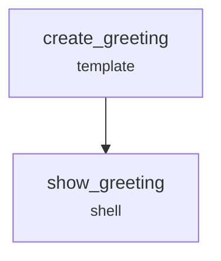

# Command Line Interface

The YAML Workflow CLI provides commands to run, validate, visualize, and manage workflows.

## Installation

The CLI is automatically installed with the package:

```bash
pip install yaml-workflow
```

## Commands

### `init` - Initialize a Project

Create a workflows directory with example files:

```bash
# Create workflows directory with all examples
yaml-workflow init

# Specify custom directory
yaml-workflow init --dir my-workflows

# Initialize with a specific example only
yaml-workflow init --example hello_world
```

### `run` - Execute a Workflow

Run a workflow file with optional parameters:

```bash
# Run with input parameters
yaml-workflow run workflows/hello_world.yaml name=Alice

# Run a specific flow
yaml-workflow run workflows/multi_flow.yaml --flow data_collection

# Resume from last failed step
yaml-workflow run workflows/hello_world.yaml --resume

# Start from a specific step
yaml-workflow run workflows/pipeline.yaml --start-from process_data

# Skip specific steps
yaml-workflow run workflows/pipeline.yaml --skip-steps "cleanup,notify"

# Custom workspace directory
yaml-workflow run workflows/hello_world.yaml --workspace ./my-run

# Custom base directory for runs
yaml-workflow run workflows/hello_world.yaml --base-dir ./output
```

#### Dry-run mode

Preview what a workflow would do without executing any tasks, creating files, or modifying state:

```bash
yaml-workflow run workflows/hello_world.yaml name=Alice --dry-run
```

Output:

```
[DRY-RUN] Workflow: Hello World
[DRY-RUN] Steps: 2 to execute

  [DRY-RUN] Step 'create_greeting' — task: template — WOULD EXECUTE
    template: Hello, Alice!
    output_file: greeting.txt
  [DRY-RUN] Step 'show_greeting' — task: shell — WOULD EXECUTE
    command: cat greeting.txt

[DRY-RUN] Complete. 2 step(s) would execute, 0 would be skipped.
[DRY-RUN] No files were written. No tasks were executed.
```

Dry-run still evaluates conditions and resolves template variables, so you can see exactly which steps would run and what inputs they would receive.

#### Watch mode

Automatically re-run the workflow when the YAML file (or any imported files) change:

```bash
yaml-workflow run workflows/hello_world.yaml name=Alice --watch
```

The engine polls file modification times every 1.5 seconds. On change, it prints a separator and re-runs. Press `Ctrl+C` to stop.

### `list` - List Available Workflows

Display workflows found in a directory:

```bash
# List workflows in default directory
yaml-workflow list

# List workflows in specific directory
yaml-workflow list --base-dir my-workflows
```

### `validate` - Validate a Workflow

Check a workflow file for configuration errors without running it:

```bash
yaml-workflow validate workflows/hello_world.yaml
```

### `visualize` - Visualize a Workflow

Display the workflow step graph as an ASCII diagram or Mermaid chart:

```bash
# ASCII output (default) — displays directly in terminal
yaml-workflow visualize workflows/hello_world.yaml

# Mermaid format — for docs, GitHub markdown, or mermaid.live
yaml-workflow visualize workflows/hello_world.yaml --format mermaid

# Visualize a specific flow
yaml-workflow visualize workflows/multi_flow.yaml --flow core_only

# Save to file
yaml-workflow visualize workflows/pipeline.yaml -f mermaid -o pipeline.md
```

#### ASCII output

Regular steps render as boxes, conditional steps as diamonds:

```
  Workflow: Complex Flow and Error Handling Demo

  ┌─────────────────┐
  │ setup_workspace │
  │      shell      │
  └─────────────────┘
           │
           ▼
  ┌─────────────────┐
  │ process_core_1  │
  │       echo      │
  └─────────────────┘
           │
           ▼
  ┌─────────────────┐
  │   flaky_step    │
  │      shell      │
  └─────────────────┘  ──error─▶ [handle_flaky_error]
           │
           ▼
  ┌─────────────────┐
  │     cleanup     │
  │      shell      │
  └─────────────────┘

  4 steps (0 conditional, 4 always-run)
  1 error path(s): flaky_step → handle_flaky_error
```

Conditional steps render as diamonds:

```
  ┌───────────────────┐
  │  validate_input   │    always runs
  │       shell       │
  └───────────────────┘
           │
           ▼
           ◇
   ╱   get_timestamp  ╲      runs only if condition is True
  ◁        shell        ▷
   ╲                   ╱
           ◇
```

#### Mermaid output

The `--format mermaid` output can be pasted into [mermaid.live](https://mermaid.live), GitHub markdown fenced blocks, or any Mermaid-compatible renderer:

````

````

### `workspace` - Manage Workflow Runs

Manage workspace directories created by workflow runs:

```bash
# List all workflow runs
yaml-workflow workspace list

# List runs for a specific workflow
yaml-workflow workspace list --workflow hello_world

# Clean up runs older than 30 days
yaml-workflow workspace clean --older-than 30

# Dry-run cleanup (show what would be deleted)
yaml-workflow workspace clean --older-than 7 --dry-run

# Remove specific runs
yaml-workflow workspace remove hello_world_run_1 hello_world_run_2

# Force remove without confirmation
yaml-workflow workspace remove hello_world_run_1 --force
```

## All Options

| Command | Flag | Description |
|---------|------|-------------|
| `run` | `workflow` | Path to workflow YAML file (required) |
| `run` | `params` | Parameters as `name=value` pairs |
| `run` | `--workspace` | Custom workspace directory |
| `run` | `--base-dir` | Base directory for runs (default: `runs`) |
| `run` | `--resume` | Resume from last failed step |
| `run` | `--start-from` | Start from a specific step |
| `run` | `--skip-steps` | Comma-separated steps to skip |
| `run` | `--flow` | Flow name to execute |
| `run` | `--dry-run`, `-n` | Preview without executing |
| `run` | `--watch`, `-w` | Watch files and re-run on changes |
| `list` | `--base-dir` | Directory containing workflows |
| `validate` | `workflow` | Path to workflow file |
| `visualize` | `workflow` | Path to workflow file |
| `visualize` | `--format`, `-f` | `text` (default) or `mermaid` |
| `visualize` | `--flow` | Flow to visualize |
| `visualize` | `--output`, `-o` | Output file (default: stdout) |
| `init` | `--dir` | Target directory (default: `workflows`) |
| `init` | `--example` | Specific example to copy |
| `--version` | | Show version and exit |
