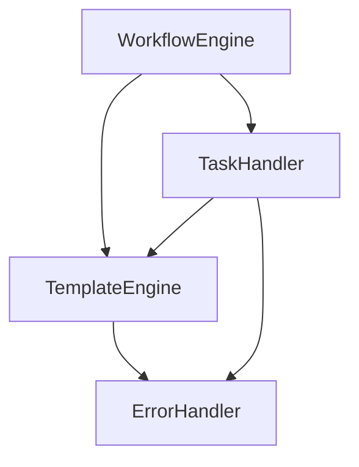

# Implementation Details: Namespaced Variables

## Requirements

### Dependencies
```python
requirements = {
    "jinja2": ">=3.0.0",    # Template processing
    "typing_extensions": ">=4.0.0",  # Type hints for Python 3.7+
}

dev_requirements = {
    "pytest": ">=7.0.0",     # Testing framework
    "pytest-cov": ">=4.0.0", # Coverage reporting
    "black": ">=22.0.0",     # Code formatting
    "mypy": ">=1.0.0"        # Type checking
}
```

### Python Version
- Minimum: Python 3.10
- Recommended: Python 3.10+

### Development Environment
- Git for version control
- Virtual environment (venv or conda)
- IDE with Python support (VS Code recommended)

## Initial Setup

1. Environment Preparation
   ```bash
   # Create and activate virtual environment
   python -m venv venv
   source venv/bin/activate  # or `venv\Scripts\activate` on Windows
   
   # Install dependencies
   pip install -r requirements.txt
   pip install -r requirements-dev.txt
   ```

2. Project Structure
   ```
   yaml-workflow/
   ├── src/
   │   └── yaml_workflow/
   │       ├── __init__.py
   │       ├── engine.py
   │       ├── template.py
   │       └── tasks/
   │           └── __init__.py
   ├── tests/
   │   ├── __init__.py
   │   ├── test_engine.py
   │   └── test_template.py
   ├── examples/
   │   └── basic_workflow.yaml
   ├── requirements.txt
   ├── requirements-dev.txt
   └── setup.py
   ```

3. Initial Validation
   ```bash
   # Run existing tests to ensure clean starting point
   pytest
   
   # Check code formatting
   black src tests
   
   # Run type checking
   mypy src
   ```

## Overview

This document describes the implementation of namespaced variables in the workflow engine:
- `args.VAR`: Access to workflow parameters
- `env.VAR`: Access to environment variables
- `steps.STEP_NAME.output`: Access to step outputs (singular, supports multiple return types)

## Current Implementation

The workflow engine uses a namespaced context structure for all variable access:

```python
self.context = {
    # Built-in variables
    "workflow_name": self.name,
    "workspace": str(self.workspace),
    "run_number": self.workspace_info.get("run_number"),
    "timestamp": datetime.now().isoformat(),
    "workflow_file": str(self.workflow_file.absolute() if self.workflow_file else ""),
    
    # Namespaced variables
    "args": {},    # Workflow parameters
    "env": dict(os.environ),  # Environment variables
    "steps": {},   # Step outputs and metadata
}
```

### Variable Resolution

Template resolution is handled using Jinja2 with StrictUndefined for better error detection:

```python
def resolve_template(self, template_str: str) -> str:
    """Resolve template with both direct and namespaced variables."""
    template = Template(template_str, undefined=StrictUndefined)
    try:
        return template.render(**self.context)
    except UndefinedError as e:
        # Enhance error message with available variables
        available = {
            "args": list(self.context["args"].keys()),
            "env": list(self.context["env"].keys()),
            "steps": list(self.context["steps"].keys())
        }
        raise TemplateError(f"{str(e)}. Available variables: {available}")
```

## Template Processing Implementation

### Overview

The template processing system provides essential Jinja2 features for workflow configuration:
- Support for basic Jinja2 control structures (``, ``)
- Simple variable substitution with namespaced access
- Basic error handling with clear messages
- Direct integration with workflow engine

### Native Jinja2 Features

The system uses standard Jinja2 control structures without modification:

1. Conditional Logic
   ```jinja2
   
     content
   
     other content
   
     default content
   
   ```

2. Loops
   ```jinja2
   
     {{ item.name }}
   
   ```

3. Assignments
   ```jinja2
   
   ```

4. Expressions
   ```jinja2
   
   ```

All these are native Jinja2 features - we simply pass them through to Jinja2's template engine without modification.

### Current Implementation

The template engine is implemented as a simple service within the workflow engine:

```python
class TemplateEngine:
    def __init__(self):
        self.env = Environment(
            undefined=StrictUndefined,
            autoescape=True
        )
        
    def process_template(self, template: str, context: Dict[str, Any]) -> str:
        """Process template with workflow context."""
        template = self.env.from_string(template)
        try:
            return template.render(**context)
        except UndefinedError as e:
            # Provide clear error with available variables
            available = {
                "args": list(context["args"].keys()),
                "env": list(context["env"].keys()),
                "steps": list(context["steps"].keys())
            }
            raise TemplateError(f"{str(e)}. Available variables: {available}")
            
    def process_value(self, value: Any, context: Dict[str, Any]) -> Any:
        """Process any value that might contain templates."""
        if isinstance(value, str) and ("{{" in value or "{%" in value):
            return self.process_template(value, context)
        return value
```

### Features

1. Core Template Processing
   - Variable substitution using native Jinja2 syntax `{{ var }}`
   - Native Jinja2 control structures:
     - `` for conditionals
     - `` for loops
     - `` for assignments
   - No custom syntax or extensions needed
   - Direct pass-through to Jinja2 engine

2. Error Handling
   - Clear error messages
   - List of available variables
   - Basic template debugging

3. Integration
   - Direct workflow engine integration
   - Simple task handler support
   - Consistent variable access

### Integration Example

```yaml
steps:
  - name: process_data
    task: python
    inputs:
      data: "{{ args.input_data }}"
      mode: "{{ env.PROCESSING_MODE }}"
    condition: "truefalse"
```

### Implementation Steps

1. Core Updates
   ```python
   # Implementation sequence with dependencies
   1.1 Update WorkflowEngine
       - Add template engine instance
       - Update template processing
       Dependencies:
       - TemplateEngine class
       - WorkflowEngine class
       Integration Points:
       - Template processing in step execution
       - Variable resolution in context
   
   1.2 Update Task Handlers
       - Use engine's template processing
       - Remove duplicate implementations
       Dependencies:
       - Updated WorkflowEngine
       - Task handler base class
       Integration Points:
       - Template processing in input handling
       - Error propagation
   
   1.3 Error Handling
       - Implement clear error messages
       - Add basic debugging support
       Dependencies:
       - TemplateError class
       - Logging configuration
       Integration Points:
       - Error handling in template processing
       - Task error propagation
   ```

2. Testing
   ```python
   2.1 Basic Tests
       - Variable substitution
       - Control structures
       - Error messages
       Test Files:
       - test_template_engine.py
       - test_variable_resolution.py
   
   2.2 Integration Tests
       - Workflow execution
       - Task processing
       Test Files:
       - test_workflow_integration.py
       - test_task_handlers.py
   ```

### Component Integration



### Migration

Each change should be small and self-contained, with full test suite execution between changes.

1. Code Updates (Sequential Steps)

   # Migration sequence - Execute full test suite after each step
   
   Step 1: Template Engine Base
   1.1 Create basic TemplateEngine class with minimal functionality
       Files: src/yaml_workflow/template.py
       Tests: tests/test_template.py
       - Basic template processing
       - Simple error handling
       Version Control:
         git checkout -b feature/template-engine
         git add src/yaml_workflow/template.py tests/test_template.py
         git commit -m "Add basic TemplateEngine class"
       Validation:
         pytest tests/test_template.py
         black src/yaml_workflow/template.py
         mypy src/yaml_workflow/template.py
   
   1.2 Add variable resolution
       Files: src/yaml_workflow/template.py
       Tests: tests/test_template.py
       - Add context support
       - Add variable lookup
       Version Control:
         git add src/yaml_workflow/template.py tests/test_template.py
         git commit -m "Add variable resolution to TemplateEngine"
       Validation:
         pytest
         black src tests
         mypy src
   
   1.3 Add error enhancement
       Files: src/yaml_workflow/template.py
       Tests: tests/test_template.py
       - Improve error messages
       - Add variable listing
       Version Control:
         git add src/yaml_workflow/template.py tests/test_template.py
         git commit -m "Enhance error handling in TemplateEngine"
       Validation:
         pytest
         black src tests
         mypy src
   
   Step 2: Engine Integration
   2.1 Add TemplateEngine to WorkflowEngine
       Files: src/yaml_workflow/engine.py
       Tests: tests/test_engine.py
       - Initialize template engine
       - Basic integration
       Version Control:
         git checkout -b feature/engine-integration
         git add src/yaml_workflow/engine.py tests/test_engine.py
         git commit -m "Integrate TemplateEngine with WorkflowEngine"
       Validation:
         pytest
         black src tests
         mypy src

2. Testing Strategy

   # Test after each change
   
   Step 1: Unit Tests
   - Run specific test for changed component
   - Run related component tests
   - Run full unit test suite
   Files: tests/test_*.py
   Command: pytest tests/
   Validation Points:
   - All tests pass
   - No regressions
   - Coverage maintained or improved
   
   Step 2: Integration
   - Run integration tests
   - Verify no regressions
   - Check example workflows
   Files: tests/test_integration.py
   Command: pytest tests/test_integration.py
   Validation Points:
   - All workflows execute successfully
   - Error messages are clear
   - Performance is maintained
   
   Step 3: Validation
   - Run example workflows
   - Check error messages
   - Verify backwards compatibility
   Files: examples/*.yaml
   Command: yaml-workflow run examples/*.yaml
   Validation Points:
   - All examples work
   - Output matches expected
   - Error handling works

3. Rollback Plan

   # Have a rollback strategy for each change
   
   For each change:
   1. Create backup of modified files
   2. Document exact changes made
   3. Keep test results before change
   4. Have clear rollback steps ready
   
   If tests fail:
   1. Revert specific change:
      git checkout -- src/yaml_workflow/template.py
      # or
      git reset --hard HEAD~1
   2. Run tests to verify restoration:
      pytest
   3. Review and adjust approach
   4. Try smaller change if needed
   
   Emergency Rollback:
   ```bash
   # Full feature rollback
   git checkout main
   git branch -D feature/template-engine
   # Clean up any artifacts
   git clean -fd
   ```

## Batch Processing Implementation

### Overview

The batch processing functionality provides simple parallel task execution:
- Basic parallel execution with worker limits
- Simple progress tracking
- Error handling per item
- Result collection

### Implementation

```python
class BatchProcessor:
    def __init__(self, max_workers: Optional[int] = None):
        """Initialize batch processor with optional worker limit."""
        self.max_workers = max_workers or os.cpu_count()
        
    def process_batch(
        self,
        items: List[Any],
        task_func: Callable[[Any], Any],
        on_error: Optional[Callable[[Any, Exception], None]] = None
    ) -> Dict[str, Any]:
        """Process items in parallel with basic error handling."""
        with ThreadPoolExecutor(max_workers=self.max_workers) as executor:
            futures = []
            results = []
            errors = []
            
            for item in items:
                future = executor.submit(task_func, item)
                futures.append((item, future))
            
            for item, future in futures:
                try:
                    result = future.result()
                    results.append(result)
                except Exception as e:
                    if on_error:
                        on_error(item, e)
                    errors.append((item, str(e)))
            
            return {
                "results": results,
                "errors": errors,
                "total": len(items),
                "successful": len(results),
                "failed": len(errors)
            }
```

### Usage Example

```yaml
steps:
  - name: process_files
    task: batch
    inputs:
      items: "{{ args.files }}"
      max_workers: 4
      task:
        name: process_file
        inputs:
          operation: compress
```

### Implementation Steps

1. Core Implementation
   ```python
   Step 1: Basic Processor
   - Implement BatchProcessor class
   - Add simple parallel execution
   - Add basic error handling
   Files: src/yaml_workflow/batch.py
   
   Step 2: Task Integration
   - Create batch task handler
   - Add result collection
   Files: src/yaml_workflow/tasks/batch.py
   ```

2. Testing
   ```python
   Step 1: Unit Tests
   - Parallel execution
   - Error handling
   Files: tests/test_batch.py
   
   Step 2: Integration
   - Task integration
   - Result handling
   Files: tests/test_batch_integration.py
   ```

## Migration Status

✅ Completed:
- Basic workflow engine functionality
- Namespaced variable support
- Simple template processing
- Basic error handling
- Core test suite

🔄 In Progress:
- Centralizing template processing
- Updating task handlers to use engine's template processing
- Adding clear error messages
- Completing integration tests
- Updating example workflows
